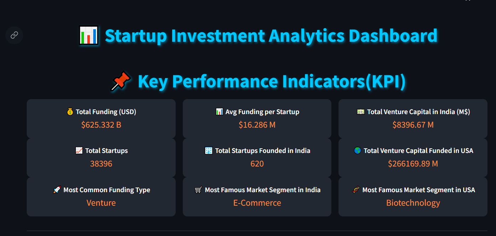
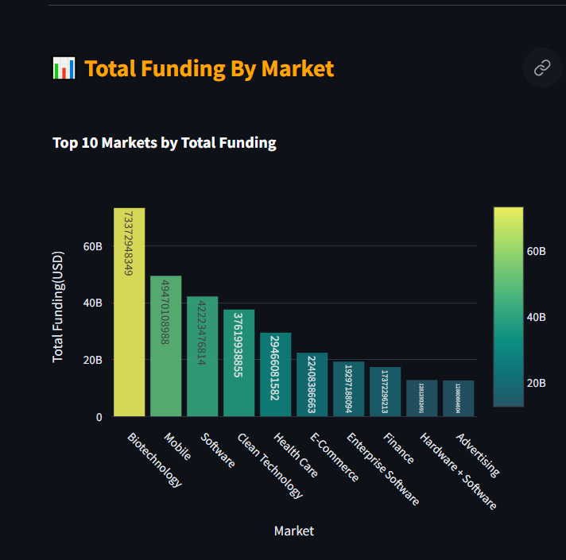
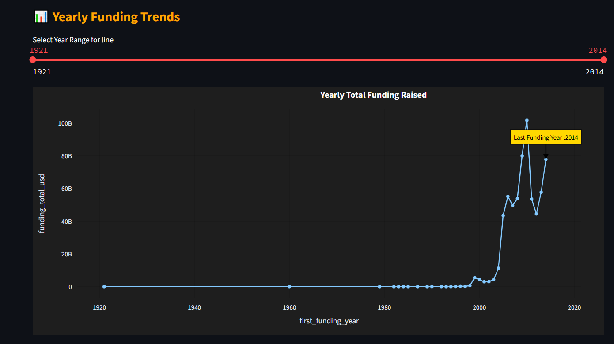
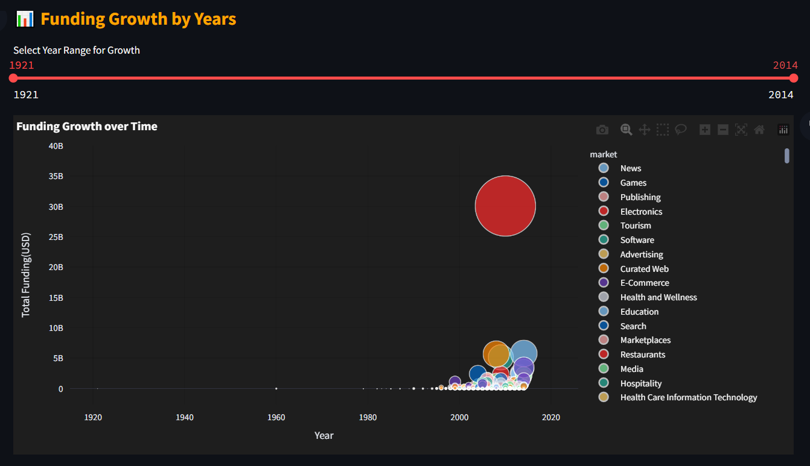
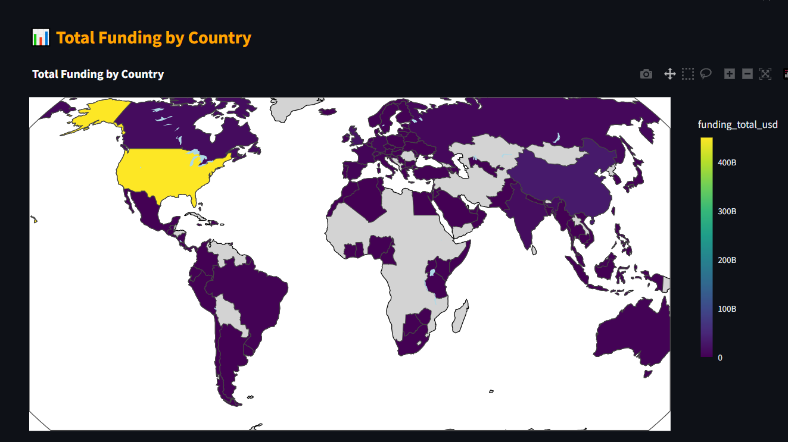

# **Startup Investment Analysis** 🚀  
### A Data-Driven Approach to Understanding Startup Funding  

  

🔍 **An interactive data analytics dashboard to explore and visualize startup investment trends.**  
 📊*A Data Analytics Project by Team Quantum Queries*  

---

# Table of Contents  

- [**Startup Investment Analysis** 🚀](#startup-investment-analysis-)
    - [A Data-Driven Approach to Understanding Startup Funding](#a-data-driven-approach-to-understanding-startup-funding)
- [Table of Contents](#table-of-contents)
  - [**🚀 Introduction**](#-introduction)
  - [**🛠️ Project Type**](#️-project-type)
  - [](#)
  - [**🌍 Live Demo**](#-live-demo)
  - [**📂 Project Structure**](#-project-structure)
  - [](#-1)
  - [**📺 Video Walkthrough**](#-video-walkthrough)
  - [**✨ Features**](#-features)
    - [📊 **Key Performance Indicators(KPI)**](#-key-performance-indicatorskpi)
    - [📊 **Country By Total Funding**](#-country-by-total-funding)
    - [📊 **Total Funding By Market**](#-total-funding-by-market)
    - [📊 **Investment Growth Over Time**](#-investment-growth-over-time)
  - [🌍 **Geographic Investment Map**](#-geographic-investment-map)
  - [**🎯 Design Decisions \& Assumptions**](#-design-decisions--assumptions)
  - [**🛠 Installation \& Setup**](#-installation--setup)
    - [**📌 Prerequisites**](#-prerequisites)
    - [**📥 Clone the Repository**](#-clone-the-repository)
    - [**📦 Install Dependencies**](#-install-dependencies)
    - [**▶️ Run the Streamlit App**](#️-run-the-streamlit-app)
  - [**📌 Usage Guide**](#-usage-guide)
  - [**🛠 Technology Stack**](#-technology-stack)
  - [**📊 APIs \& Datasets**](#-apis--datasets)
  - [🚀 **Future Enhancements**](#-future-enhancements)
  - [**🤝 Contribution Guide**](#-contribution-guide)
  - [**👨‍💻 Team Members**](#-team-members)
  - [**📜 License**](#-license)
  - [**📩 Stay Connected**](#-stay-connected)
    - [**🚀 Ready to Explore Startup Investment Trends?**](#-ready-to-explore-startup-investment-trends)

---

## **🚀 Introduction**  
**Startup Investment Analysis** is a data analytics project by **Quantum Queries**, designed to uncover insights from startup funding data. Our interactive dashboard helps investors, entrepreneurs, and analysts make data-driven decisions by visualizing key trends such as:  

📌 **Funding Rounds Analysis** – Understand the investment landscape.  
📌 **Investor Trends** – Identify top investors and their interests.  
📌 **Industry Breakdown** – Track investment across different sectors.  
📌 **Geographical Insights** – See where startups are flourishing.  
📌 **Time-Series Trends** – Analyze funding growth over time. 


We leverage **Python, Jupyter Notebook, Pandas, NumPy, Plotly, and Streamlit** to create an intuitive and engaging experience.  

---

## **🛠️ Project Type**  
🔹 **Data Analytics**  
🔹 **Dashboard Development**  

---

## **🌍 Live Demo**  
🔗 **Try it Now** → [Startup Investment Analysis Dashboard](https://quantumqueries.streamlit.app/)  

---

## **📂 Project Structure**  
```
📦 QUANTUM_QUERIES/
├── 🐍 .venv/               # Virtual environment for dependencies  
├── ⚙️ .vscode/             # VS Code settings and configurations  
├── 🖼️ assets/             # Images, GIFs, and other media assets  
├── 📊 data/               # Raw and processed datasets  
├── 🔄 data_wrangling/     # Scripts for data cleaning and transformation  
├── 📈 EDA/                # Exploratory Data Analysis scripts and notebooks  
├── 📦 modules/            # Custom Python modules used in the project  
├── 🚀 app.py              # Main Streamlit app script  
├── 📖 README.md           # Project documentation  
├── 📜 requirements.txt    # List of dependencies  

```

---

## **📺 Video Walkthrough**  
🎥 **Project Walkthrough:** _(Coming Soon)_  
🎥 **Codebase Walkthrough:** _(Coming Soon)_  

---

## **✨ Features**  
✅ **Real-Time Data Visualization** – Interactive charts using **Plotly**  
✅ **Customizable Filters** – Filter data based on **year, investor, industry, funding amount**  
✅ **Geographical Mapping** – Funding distribution across locations  
✅ **Dynamic Insights** – Explore trends over different time periods  
✅ **User-Friendly Interface** – Built with **Streamlit** for ease of use  
✅ **Scalable & Extensible** – Can integrate **real-time data updates** in the future  

---

---
### 📊 **Key Performance Indicators(KPI)**

### 📊 **Country By Total Funding**

### 📊 **Total Funding By Market**


**Time-Series Trends**

### 📊 **Investment Growth Over Time**



## 🌍 **Geographic Investment Map**
 

---

## **🎯 Design Decisions & Assumptions**  
🔸 **Data Sourcing** – We use structured datasets from **public and private sources**.  
🔸 **Visualization Library** – **Plotly** is chosen for its **interactivity** and **customization**.  
🔸 **Data Processing** – **Pandas & NumPy** for fast and efficient manipulation.  
🔸 **Deployment** – **Streamlit** for quick and accessible web-based analysis.  
🔸 **Scalability** – Future plans include **real-time API integration** for live data.  

---

## **🛠 Installation & Setup**  
Follow these steps to set up and run the project on your local machine.

### **📌 Prerequisites**  
Ensure you have **Python 3.8+** installed.  

### **📥 Clone the Repository**  
```bash
git clone https://github.com/your-repo/startup-investment-analysis.git
cd startup-investment-analysis
```

### **📦 Install Dependencies**  
```bash
pip install -r requirements.txt
```

### **▶️ Run the Streamlit App**  
```bash
streamlit run app/main.py
```

---

## **📌 Usage Guide**  
Once the app is running, explore different sections of the dashboard:  

📊 **Investment Trends** → Analyze funding rounds & trends.  
📈 **Investor Insights** → See top investors and funding rounds.  
🌎 **Geographical Mapping** → Visualize investment distribution.  
🔍 **Custom Filters** → Adjust filters to analyze specific data points.  

---

## **🛠 Technology Stack**  
| **Technology** | **Purpose** |
|--------------|------------|
| **Python** | Core programming language |
| **Jupyter Notebook** | Data analysis and visualization |
| **Pandas & NumPy** | Data processing & manipulation |
| **Plotly** | Interactive data visualizations |
| **Streamlit** | Web framework for dashboard deployment |

---

## **📊 APIs & Datasets**  
The project primarily uses **CSV datasets** for analysis. In the future, we plan to integrate **real-time APIs** for live data updates.

---
---
## 🚀 **Future Enhancements**  
✔️ **AI-Powered Predictions** – Forecasting future investment trends.  
✔️ **Deeper Sector Analysis** – More industry-specific insights.  
✔️ **Integration with Live APIs** – Fetch real-time funding data.

---
## **🤝 Contribution Guide**  
We welcome contributions! Follow these steps:  
1. **Fork the repository**.  
2. **Create a new branch** → `git checkout -b feature-name`.  
3. **Make your changes** and **commit** → `git commit -m "Added new feature"`.  
4. **Push to your branch** → `git push origin feature-name`.  
5. **Open a Pull Request** 🚀.  

**Want to contribute?** Check our [Contribution Guide](CONTRIBUTING.md)  

---

## **👨‍💻 Team Members**  
💡 **Quantum Queries Team**  
👤 **Ankit Yadav** – Data Engineer & Visualization Specialist  
👤 **Vishal Kapoor** – Data Scientist & Analyst  
👤 **Sadnya** – Data Scientist & Analyst  
👤 **Sarika** – Data Scientist & Analyst 

---

## **📜 License**  
This project is licensed under the **MIT License**. See the [LICENSE](LICENSE) file for details.  

---


## **📩 Stay Connected**  

🔗 **GitHub Repository** → [](https://github.com/ankityadav-problemsolver/B42_DA_005_Quantum-Queries)  

📩 **Contact Us** → [](mailto:ankitofficial151@gmail.com)  

📌 **Follow us on LinkedIn** → [](https://www.linkedin.com/in/ankityadav-datasolver/)  

---

### **🚀 Ready to Explore Startup Investment Trends?**  
👉 [Launch the Dashboard Now](https://quantumqueries.streamlit.app/)  

---

